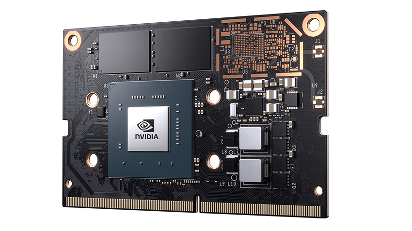
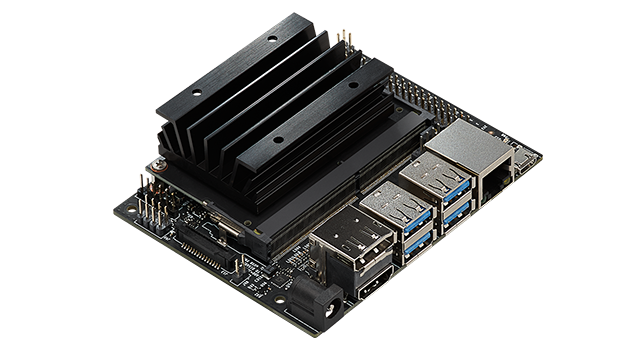

# [Jetson Nano](https://github.com/sochub/Jetson) 

#### 归属：[Cortex-A57](https://github.com/sochub/CA57)
#### 父级：[nvidia](https://github.com/sochub/nvidia)
### [描述](https://github.com/sochub/Jetson/wiki) 

[NVIDIA Jetson Nano](https://www.nvidia.cn/autonomous-machines/embedded-systems/jetson-nano/) 助力开发数百万个新的小型、低功率的 AI 系统。 它开启了嵌入式物联网应用程序的新领域，包括入门级网络硬盘录像机 (NVR)、家用机器人以及具备全面分析功能的智能网关。

Jetson Nano 模组仅有 70 x 45 毫米，是体积非常小巧的 Jetson 设备。 为多个行业（从智慧城市到机器人）的边缘设备部署 AI 时，此生产就绪型模组系统 (SOM) 可以提供强大支持，使用260针边缘连接器。

官方定价：99刀，5-10w，472 GFLOPs

- [文档](docs/)
- [资源](src/)

* GPU	NVIDIA Maxwell™ 架构，配备 128 个 NVIDIA CUDA® 核心
* CPU	四核Cortex®-A57处理器,4GB位LPDDR4,16GB eMMC 5.1闪存
* 4K @ 60 (H.264/H.265), 12 通道（3x4 或 4x2）MIPI CSI-2 DPHY 1.1 (1.5 Gbps)
* HDMI 2.0 或 DP1.2 | eDP 1.4 | DSI (1 x2) 2 同步,千兆以太网
* 1 x1/2/4 PCIE、1x USB 3.0、3x USB 2.0
* 1x SDIO/2x SPI/6x I2C/2x I2S/GPIO

###  [SoC开发平台](http://www.qitas.cn)   
