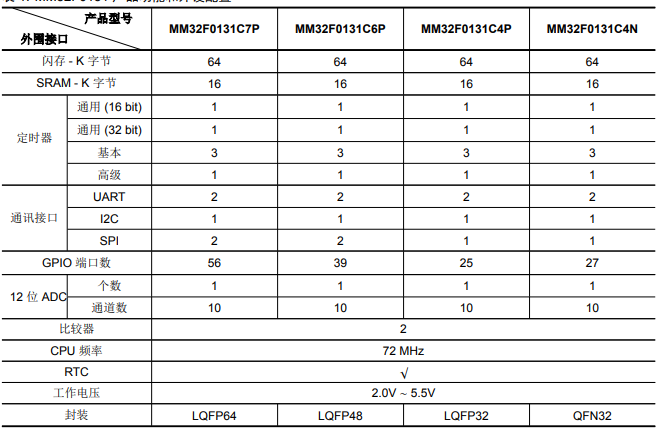

# [MM32F013](https://github.com/SoCXin/MM32F013)

#### [MindMotion](http://www.mindmotion.com.cn/)：[Cortex M0](https://github.com/SoCXin/CM0)
#### [Level](https://github.com/SoCXin/Level)：72 MHz

## [描述](https://github.com/SoCXin/MM32F013/wiki)

[MM32F013](https://github.com/SoCXin/MM32F013)

### [资源收录](https://github.com/SoCXin/MM32F013)

* [文档](docs/)
* [资源](src/)
* [工程](project/)

### [选型建议](https://github.com/SoCXin)

* [MM32F013](https://github.com/SoCXin/MM32F013)

###  [芯云 www.SoC.Xin](http://www.SoC.Xin)

